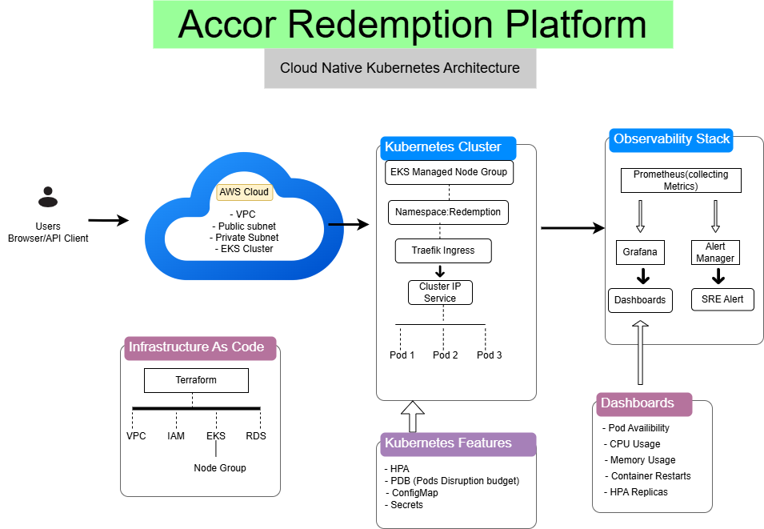

# Accor Redemption Platform

A cloud-native redemption platform built using **AWS, Terraform, Kubernetes, and Observability tooling**.

This project demonstrates a production-style DevOps implementation covering:

- Infrastructure as Code
- Kubernetes deployment
- High availability
- Auto scaling
- Application configuration management
- Monitoring and alerting
- Day 2 operational practices

---

# Architecture



## Design Document

[Accor Design Document](docs/Accor-Design-Document.pdf)
---

# Project Overview

The Accor Redemption Platform is designed to provide a scalable and reliable application platform running on Kubernetes.

The solution uses:

- Terraform for AWS infrastructure provisioning
- Kubernetes for container orchestration
- EKS for managed Kubernetes operations
- Prometheus and Grafana for observability
- AlertManager for operational alerting

The platform is designed with production reliability principles:

- High availability
- Automated scaling
- Self-healing workloads
- Infrastructure automation
- Operational visibility

---

# Technology Stack

## Cloud Platform

- AWS

## Infrastructure as Code

- Terraform

## Container Platform

- Kubernetes
- Amazon EKS

## Kubernetes Components

- Deployment
- Service
- Ingress
- ConfigMap
- Secrets
- Horizontal Pod Autoscaler (HPA)
- PodDisruptionBudget (PDB)

## Networking

- Kubernetes Ingress
- Traefik Ingress Controller

## Monitoring

- Prometheus
- Grafana
- AlertManager
- PrometheusRule

---

# Repository Structure

.
├── README.md
├── docs
│   ├── architecture.md
│   └── design-document.md
├── kubernetes
│   ├── configmap.yaml
│   ├── deployment.yaml
│   ├── hpa.yaml
│   ├── ingress.yaml
│   ├── namespace.yaml
│   ├── pdb.yaml
│   ├── secret.yaml
│   └── service.yaml
├── monitoring
│   ├── accor-alerts.yaml
│   ├── grafana-values.yaml
│   └── prometheus-values.yaml
├── scripts
└── terraform
    ├── main.tf
    ├── modules
    │   ├── eks
    │   │   ├── main.tf
    │   │   ├── outputs.tf
    │   │   └── variables.tf
    │   ├── iam
    │   ├── nodegroup
    │   │   ├── main.tf
    │   │   ├── outputs.tf
    │   │   └── variables.tf
    │   ├── rds
    │   └── vpc
    │       ├── main.tf
    │       ├── outputs.tf
    │       └── variables.tf
    ├── outputs.tf
    ├── providers.tf
    ├── variables.tf
    └── versions.tf

---

# Infrastructure Design

Infrastructure is provisioned using Terraform modules.

## Terraform Components

### VPC Module

Responsible for:

- AWS networking
- Subnet configuration
- Network isolation

### EKS Module

Responsible for:

- Managed Kubernetes cluster
- Kubernetes control plane
- Cluster configuration

### Node Group

Responsible for:

- Kubernetes worker capacity
- Running application workloads
- Providing compute resources for pods

### IAM Module

Responsible for:

- AWS permissions
- Access control

### RDS Module

Responsible for:

- Managed database infrastructure

---

# Kubernetes Application Design

The application runs inside the Kubernetes namespace: redemption

## Deployment

Application deployment configuration:Replicas: 3

Benefits:

- High availability
- Pod failure recovery	
- Rolling updates


## Service

Service type: ClusterIP

Purpose:

- Internal service discovery
- Stable communication between workloads


## Ingress

Traefik Ingress Controller provides:

- External traffic routing
- Application access management


## ConfigMap

Application configuration:
ENVIRONMENT=production
LOG_LEVEL=INFO
REGION=APAC
FEATURE_REDEMPTION_ENABLED=true


## Secret

Sensitive configuration:
DATABASE_USERNAME
DATABASE_PASSWORD
API_KEY

---

# Reliability and Scaling

## Horizontal Pod Autoscaler (HPA)

Configuration:
Minimum replicas: 3
Maximum replicas: 10
CPU target: 70%

Purpose:

- Automatically scale application pods
- Handle increased workload


## PodDisruptionBudget (PDB)

Configuration:
Minimum Available Pods: 2

Purpose:

- Maintain availability during maintenance
- Prevent excessive pod disruption

---

# Monitoring and Observability

The platform implements a monitoring stack using Prometheus and Grafana.

## Prometheus

Collects:

- Kubernetes metrics
- Container metrics
- Resource utilization


## Grafana Dashboard

Implemented dashboards for:

### Pod Availability

Monitors:

- Running replicas
- Application availability


### CPU Usage

Monitors:

- Container CPU consumption


### Memory Usage

Monitors:

- Memory utilization


### Container Restarts

Monitors:

- Application stability


### HPA Status

Monitors:

- Scaling activity

---

# Alerting

Custom Prometheus rules are configured:

File:
monitoring/accor-alerts.yaml

Implemented alerts:

## RedemptionPodDown

Detects:

- Application replica availability issues


## RedemptionHighCPU

Detects:

- High CPU consumption


## RedemptionContainerRestart

Detects:

- Frequent container restarts


Alert flow:
Kubernetes Metrics
    |

Prometheus

    |
Prometheus Rules
    |
AlertManager
    |
Operational Alert


---

# Day 2 Operations Strategy

The platform is designed to reduce operational toil.

## Infrastructure Automation

Implemented:

- Terraform modules
- Version controlled infrastructure
- Repeatable deployments


## Kubernetes Automation

Implemented:

- Self-healing pods
- Rolling deployments
- Horizontal scaling
- Availability protection


## Observability Automation

Implemented:

- Prometheus monitoring
- Grafana dashboards
- Automated alert rules


## Recommended Operational Practices

- CI/CD automation
- Automated rollback procedures
- Incident response runbooks
- Security patch management
- Regular infrastructure reviews

---

# Team Responsibility Model

Recommended team structure:

## Senior Engineer

Responsibilities:

- Overall architecture design
- Terraform modules
- AWS networking
- EKS design
- Security review
- Code reviews


## Junior Engineer 1

Responsibilities:

- Kubernetes manifests
- Deployment configuration
- Services
- Ingress
- ConfigMaps
- Secrets


## Junior Engineer 2

Responsibilities:

- Monitoring stack
- Grafana dashboards
- Prometheus alerts
- Documentation
- Testing

---

# Deployment Workflow

Infrastructure:
Terraform
   |
AWS Resources
   |
EKS Cluster
   |
Node Group
   |
Application: Kubernetes manifest
   |
Deployment
   |
Service
   |
Ingress
   |
Application Pods

---

# Validation Commands

## Terraform

```bash
terraform fmt

terraform init

terraform validate

Author

Accor Redemption Platform

Cloud Native DevOps Implementation
